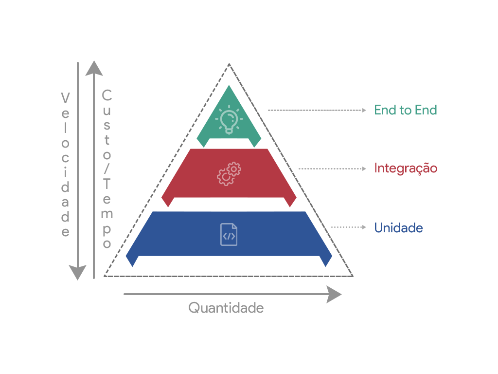

<h1 align="center">
    
</h1>
<p align="center">
  <a href="./LICENSE.md" title="License MIT">
    
  </a>
  
       

  

</p>
<p align="center">
  <a target="_blank" href="https://reactjs.org/">
    
  </a>

  <a target="_blank" href="https://nextjs.org/">
      
  </a>

</p>

## :bookmark_tabs: About

This application was created to exemplify good unit testing practices.

Feel free to copy and reproduce this content, as well as use it as study material to improve your code and standardization within a development team.

## :electric_plug: Technologies:

- **[NodeJS](https://nodejs.org/pt-br/)**
- **[Jest](https://jestjs.io/pt-BR/)**
- **[TypeScript](https://www.typescriptlang.org/)**
- **[Express](https://expressjs.com/)**
- **[Supertest](https://github.com/visionmedia/supertest#readme)**


## :rocket: How to run project
Clone the project and access the folder

```bash
$ git clone https://github.com/schluters/presentation-teste.git && cd presentation-teste
```

Follow the steps below
```bash
# Install the dependencies
$ yarn

# Start the project
$ yarn start:dev

# The server will start at port:3000 - go to http://localhost:3000

# Run tests
$ yarn test
```

### :memo: Settings .ENV
```bash
# BASE APP
PORT=3000
NODE_ENV=dev
```

## :book: License

Fully open and free code for studies and copies under license [MIT](LICENSE.md).


## :mortar_board: Developed by

Made with :heart: by **Herson Schluter**

<p align="left">
  <a href="https://github.com/schluters">
    
  </a>
  <a href="https://www.linkedin.com/in/herson-schluter-3b664937/">
    
  </a>
</p>
